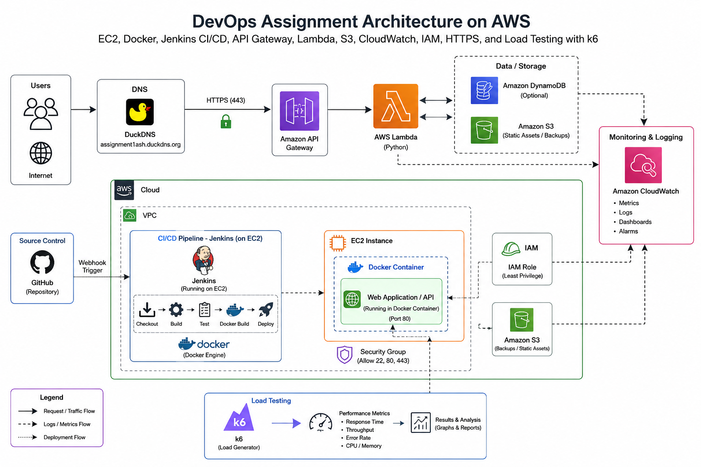

# Hybrid Cloud DevOps Infrastructure on AWS
> **Production-Ready CI/CD Frontend Deployment & Serverless Backend Architecture**

[](https://aws.amazon.com/)
[](https://www.docker.com/)
[](https://www.jenkins.io/)
[](https://k6.io/)
[](https://www.duckdns.org/)
[](https://opensource.org/licenses/MIT)

This repository demonstrates a production-grade, hybrid DevOps infrastructure deployed on AWS Free Tier. It showcases best practices in automated CI/CD pipelines, containerization, serverless backend workflows, secure networking, and real-time observability.

---

## 📌 Project Overview

This architecture is designed around two core paths:
1. **Containerized CI/CD Path**: A static frontend web application is containerized using Docker and deployed on an AWS EC2 instance. Jenkins orchestrates the checkout, build, testing, deployment, and backup processes natively.
2. **Serverless Backend Path**: End users query the system via custom DuckDNS domain names (`assignment1ash.duckdns.org`). The requests are secured via HTTPS, routed through AWS API Gateway, executed via AWS Lambda, backed by Amazon S3 storage, and monitored in real-time via CloudWatch.

---

## 📐 System Architecture

Below is the visual schematic of the deployed infrastructure:



### Architectural Flow Highlights
*   **The Deployment Path (Dotted Purple Line)**: Developer pushes to GitHub $\rightarrow$ Webhook triggers Jenkins on EC2 $\rightarrow$ Jenkins reads [metadata.json](file:///a:/Assignment/config/metadata.json) $\rightarrow$ Builds Docker image $\rightarrow$ Performs resource-capped deployment $\rightarrow$ Runs local health check $\rightarrow$ Syncs build artifacts and configuration to Amazon S3.
*   **The Application Path (Solid Black Line)**: User visits `https://assignment1ash.duckdns.org` $\rightarrow$ DuckDNS resolves to AWS API Gateway $\rightarrow$ API Gateway routes to AWS Lambda $\rightarrow$ Lambda queries Amazon S3 (and optional DynamoDB) $\rightarrow$ Execution metrics are pushed to Amazon CloudWatch.
*   **The Load Testing Path (Blue Box)**: k6 acts as an external load generator, sending HTTPS requests to the application to test latency, throughput, and system limits, reporting results back directly.

For a detailed analysis of every block, please refer to [ARCHITECTURE.md](file:///a:/Assignment/ARCHITECTURE.md).

---

## 🚀 Key Features

*   **Metadata-Driven Pipelines**: Avoids hardcoded ports or environment details by dynamically reading configurations from [metadata.json](file:///a:/Assignment/config/metadata.json).
*   **Resource Hardening**: Protects the t2.micro EC2 instance from resource starvation by capping Docker build memory (`--memory=512m`) and container runtime memory (`--memory=256m`).
*   **Continuous Observability**: System performance, HTTP traffic, Docker logs, and Nginx connections are tracked in real-time via an Amazon CloudWatch Dashboard.
*   **Automated Backups**: Successful builds are automatically archived in a secure, encrypted S3 bucket.
*   **TLS/HTTPS Termination**: Integrated security via DuckDNS dynamic routing and cert termination.
*   **Load Testing Validation**: Built-in verification with k6 to enforce latency SLA thresholds (p95 < 2.0s).

---

## 🛠️ AWS Services & Technologies Used

*   **AWS EC2**: Hosts the Jenkins server and running Docker containers.
*   **AWS Lambda (Python)**: Executes backend logic on-demand without server overhead.
*   **Amazon API Gateway**: Acts as the entry-point router, managing TLS handshakes.
*   **Amazon S3**: Hosts static backups, configurations, and Lambda datasets.
*   **Amazon CloudWatch**: Gathers system metrics (agent-based) and logs for alerting.
*   **IAM & Security Groups**: Limits access scope using least-privilege policies.
*   **DuckDNS**: Dynamic DNS provider representing domain mappings.
*   **k6**: Modern load testing tool used for performance verification.

---

## 📂 Repository Structure

```text
├── .gitignore                   # Excludes temporary run logs, workspaces, and vendor caches
├── README.md                    # This portal
├── DEPLOYMENT_GUIDE.md          # Complete deployment walk-through
├── SECURITY_SUMMARY.md          # Security hardening analysis
├── PERFORMANCE_REPORT.md        # k6 load testing execution metrics
├── MONITORING.md                # CloudWatch metrics, dashboards, and alarms
├── ARCHITECTURE.md              # In-depth architectural review
├── REPORT.md                    # Comprehensive academic/technical report
├── PROJECT_STRUCTURE.md         # Detailed index of all files/directories
├── DEMO_SCRIPT.md               # 5-10 minute presentation walk-through script
├── app/                         # Frontend application source code
├── config/                      # Dynamic pipeline parameters
├── docker/                      # Docker container building files
├── jenkins/                     # Jenkinsfile pipeline definition
└── k6/                          # Load testing scripts and results
```

For file-by-file explanations, see [PROJECT_STRUCTURE.md](file:///a:/Assignment/PROJECT_STRUCTURE.md).

---

## 🔧 Installation & Deployment

Deploying the system takes 5 main steps:
1. **Setup AWS Infrastructure**: Provision an EC2 instance (`t2.micro`, Ubuntu) and attach the `EC2-App-Role` IAM Role. Set up an S3 bucket with default encryption.
2. **Configure Security Groups**: Restrict ports `22` (SSH), `8080` (Jenkins UI), and `443` (HTTPS) to your admin IP. Keep `80` (HTTP) open for certificate routing.
3. **Provision the EC2 Instance**: Install Docker, AWS CLI, and configure Jenkins to run as a Docker container mounting the host's `/var/run/docker.sock`.
4. **Link Jenkins & GitHub**: Set up a pipeline linking to your repository. Establish GitHub webhooks to trigger builds on commit.
5. **Set up API Gateway, Lambda, and DNS**: Set up the Lambda backend, expose it via API Gateway, and route traffic through DuckDNS.

For commands, configurations, and scripts, read the [DEPLOYMENT_GUIDE.md](file:///a:/Assignment/DEPLOYMENT_GUIDE.md).

---

## 📈 Performance Testing Results

A performance run was executed using **k6** against the dynamic HTTPS endpoint. Under a ramped load profile scaling to 50 concurrent users:

*   **Total Requests**: 5,249
*   **Success Rate**: 100% (0 errors)
*   **Average Response Time**: 32.69 ms
*   **P95 Latency**: 38.63 ms
*   **Maximum Latency**: 163.6 ms

The system easily met the threshold of `p95 < 2000ms`. Detailed reports, graph discussions, and bottleneck reviews can be found in [PERFORMANCE_REPORT.md](file:///a:/Assignment/PERFORMANCE_REPORT.md).

---

## 🛡️ Security Posture

The repository adheres to stringent security paradigms:
*   **Identity**: No static AWS access keys. The EC2 instance accesses S3 and CloudWatch via temporary credentials provided by an IAM role.
*   **Network Boundaries**: Port restriction shields Jenkins and SSH ports from public scanning.
*   **Data Protection**: Buckets are encrypted via AES-256 and configured with strict public access blocks.
*   **Container Security**: Nginx container runs as a read-only root system where possible, with logging size limits set to prevent disk filling.

Read [SECURITY_SUMMARY.md](file:///a:/Assignment/SECURITY_SUMMARY.md) for more details.

---

## 🔭 Future Improvements

1.  **Orchestration Upgrade**: Migrate the containerized frontend to Amazon ECS (Fargate) or Amazon EKS (Kubernetes) to remove EC2 single points of failure.
2.  **Infrastructure as Code (IaC)**: Automate the resource configuration using HashiCorp Terraform or AWS CloudFormation.
3.  **Secrets Management**: Integrate AWS Secrets Manager to dynamically inject API credentials at runtime.
4.  **Content Delivery**: Serve the static app directly from CloudFront caching edges, utilizing EC2/ECS only for dynamic API operations.

---

## 📸 Screenshots

*Ensure to populate this section with your actual deployment screenshots before submission:*
1. **Jenkins Successful Pipeline Run**: Shows stages `Checkout`, `Read Metadata`, `Build Image`, `Deploy Container`, `Health Check`, and `Backup to S3` in green.
2. **CloudWatch Dashboard**: Displays widgets showing EC2 CPU utilization, network traffic, Nginx logs, and memory allocation.
3. **API Gateway Execution Log**: Displays the dynamic API response and latency logs.
4. **k6 Command Line Output**: Displays the final statistics summary matching the 5,249 request count.

---

## 📄 License

This project is licensed under the MIT License - see the [LICENSE](LICENSE) file for details.
